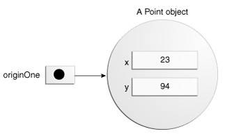
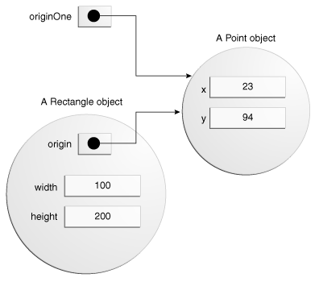

Java

[Java SE Specifications](https://docs.oracle.com/javase/specs/)

# [Java Memory Model](https://github.com/hks1/java-tutorial/blob/main/src/main/java/com/tutorial/memorymodel/java-memory-model.md#java-memory-model)

# [Java Synchronized Blocks](https://github.com/hks1/java-tutorial/blob/main/src/main/java/com/tutorial/concurrency/syncronized/synchronized.md#synchronized)

# Object Creation
<!-- https://docs.oracle.com/javase/tutorial/java/javaOO/objectcreation.html -->
1. Declaration - associate a variable name with an object type
2. Instantiation - The `new` keyword is a java operator that creates the object
3. Initialization - The `new` operator is followed by a call to a constructor, which initializes the new object

## Declaring a Variable to Refer to an Object
_type name;_

## Instantiating a Class
- The `new` operator instantiates a class by allocating memory for a new object and returning a reference to that memory. The `new` operator also invokes the object constructor.
- The `new` operator requires a single, postfix argument: a call to a constructor. The name of the constructor provides the name of the class to instantiate.
- The `new` operator returns a reference to the object it created. This reference is usually assigned to a variable of the appropriate type, like:

Point originOne = new Point(23, 94);
- The reference returned by the `new` operator does not have to be assigned to a variable. It can also be used directly in an expression. For example:

int height = new Rectangle().height;
## Initializing an Object
```java
public class Point {
    public int x = 0;
    public int y = 0;
    //constructor
    public Point(int a, int b) {
        x = a;
        y = b;
    }
}
```

`Point originOne = new Point(23, 94);`



```java
public class Rectangle {
    public int width = 0;
    public int height = 0;
    public Point origin;

    // four constructors
    public Rectangle() {
        origin = new Point(0, 0);
    }
    public Rectangle(Point p) {
        origin = p;
    }
    public Rectangle(int w, int h) {
        origin = new Point(0, 0);
        width = w;
        height = h;
    }
    public Rectangle(Point p, int w, int h) {
        origin = p;
        width = w;
        height = h;
    }

    // a method for moving the rectangle
    public void move(int x, int y) {
        origin.x = x;
        origin.y = y;
    }

    // a method for computing the area of the rectangle
    public int getArea() {
        return width * height;
    }
}
```

`Rectangle rectOne = new Rectangle(originOne, 100, 200);`

> an object can have multiple references to it, as shown below




> All classes have at least one constructor. If a class does not explicitly declare any, the Java compiler automatically provides a no-argument constructor, called the _default constructor_. This default constructor calls the class parent's no-argument constructor, or the `Object` constructor if the class has no other parent. If the parent has no constructor (`Object` does have one), the compiler will reject the program.

# Access Modifiers
<!-- https://howtodoinjava.com/java/oops/java-access-modifiers/ -->

Java provides four access modifiers to set access levels for classes, variables, methods and [constructors](https://howtodoinjava.com/java/oops/java-constructors/) i.e. public, private, protected and default.

- public – accessible everywhere
- protected – accessible in the same package and subclasses outside the package
- default – accessible only in the same package
- private – accessible only in the same class

> public > protected > package-private (or default) > private

> to access a public class in the different package, class needs to needs to be imported first

> the fields in an interface are implicitly public static final and the methods in an interface are, by default, public.

> The topmost classes and interfaces cannot be private.

> Local variables and formal parameters cannot take access specifiers. Since they are inherently inaccessible to the outside according to scoping rules, they are effectively private.

> Both private and protected can be (and frequently are) applied to nested classes and interfaces, just never top-level classes and interfaces.


**Levels of access control**

- Class level access – allows modifiers to be public, or package-private (default).
- Method level access – allows modifiers to be public, private, protected, or package-private (default).


# Design Patterns

[Abstract Factory](https://github.com/hks1/java-tutorial/blob/main/src/main/java/com/hks/design/patterns/abstractfactory/abstract-factory-pattern.md#abstract-factory)

[Adaptor](https://github.com/hks1/java-tutorial/blob/main/src/main/java/com/hks/design/patterns/adapter/adapter-pattern.md#adapter-pattern)

[Builder](https://github.com/hks1/java-tutorial/blob/main/src/main/java/com/hks/design/patterns/builder/builder-pattern.md#builder)

[Factory](https://github.com/hks1/java-tutorial/blob/main/src/main/java/com/hks/design/patterns/factory/factory-pattern.md#factory-)

[Factory Method](https://github.com/hks1/java-tutorial/blob/main/src/main/java/com/hks/design/patterns/factorymethod/factory-method-pattern.md#factory-method-)

[Observer](https://github.com/hks1/java-tutorial/blob/main/src/main/java/com/hks/design/patterns/observer/observer-pattern.md#observer-pattern)

[Chain of Responsibility](https://github.com/hks1/java-tutorial/blob/main/src/main/java/com/hks/design/patterns/chainofresponsibility/chain-of-responsibility.md#chain-of-responsibility-design-pattern)

[Singleton](https://github.com/hks1/java-tutorial/blob/main/src/main/java/com/hks/design/patterns/singleton/singleton.md#singleton-design-pattern)

# [Java Reflection](https://github.com/hks1/java-tutorial/blob/main/src/main/java/com/tutorial/reflection/reflection.md#java-reflection)

# [Java Annotations](https://github.com/hks1/java-tutorial/blob/main/src/main/java/com/tutorial/annotations/annotations.md#java-annotations)

# [Concurrency](https://github.com/hks1/java-tutorial/blob/main/src/main/java/com/tutorial/concurrency/README.md)

# [volatile keyword](https://github.com/hks1/java-tutorial/blob/main/src/main/java/com/tutorial/concurrency/volatile.md)

# [Functional Interface](https://github.com/hks1/java-tutorial/blob/main/src/main/java/com/tutorial/functional/functional.md)

# [Predicate](https://github.com/hks1/java-tutorial/blob/main/src/main/java/com/tutorial/functional/predicate/predicate.md)

# [Java Record](https://github.com/hks1/java-tutorial/blob/main/src/main/java/com/tutorial/records/Record.md)

# [Constructors](https://github.com/hks1/java-tutorial/blob/main/src/main/java/com/tutorial/constructors/readme.md)


