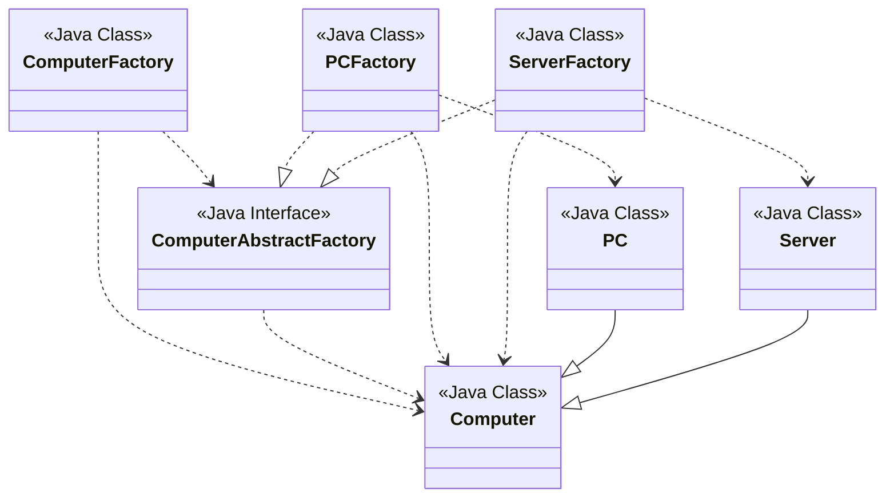

# Abstract Factory
<!-- Creational pattern -->
Like factory of factories.
<!-- https://www.digitalocean.com/community/tutorials/abstract-factory-design-pattern-in-java -->
<!-- https://github.com/WebJournal/journaldev/tree/master/java-design-patterns/Abstract-Factory-Design-Pattern -->
Factory class for each sub-class. </br>
An Abstract Factory class returns the subclass based on the input factory class.

## Abstract Factory Design Pattern Super Class and Subclasses

```java
package com.hks.design.patterns.model;

public abstract class Computer {
    public abstract String getRAM();
    public abstract String getHDD();
    public abstract String getCPU();

    @Override
    public String toString() {
        return "RAM: " +this.getRAM()+
                " HDD: " + this.getHDD()+
                " CPU: " + this.getCPU();
    }
}

```

```java
package com.hks.design.patterns.model;

public class PC extends Computer{
    private String ram;
    private String hdd;
    private String cpu;

    public PC(String ram, String hdd, String cpu){
        this.ram = ram;
        this.hdd = hdd;
        this.cpu = cpu;
    }

    @Override
    public String getRAM() {
        return this.ram;
    }

    @Override
    public String getHDD() {
        return this.hdd;
    }

    @Override
    public String getCPU() {
        return this.cpu;
    }
}

```

```java
package com.hks.design.patterns.model;

public class Server extends Computer{
    private String ram;
    public String hdd;
    private String cpu;

    public Server(String ram, String hdd, String cpu){
        this.ram = ram;
        this.hdd = hdd;
        this.cpu = cpu;
    }

    @Override
    public String getRAM() {
        return this.ram;
    }

    @Override
    public String getHDD() {
        return this.hdd;
    }

    @Override
    public String getCPU() {
        return this.cpu;
    }
}

```

## Factory Class for Each subclass
create a Abstract Factory interface or abstract class

```java
package com.hks.design.patterns.abstractfactory.model;

import com.hks.design.patterns.model.Computer;

public interface ComputerAbstractFactory {
    public Computer createComputer();
}

```

Now factory classes will implement this interface and return their respective subclass.

```java
package com.hks.design.patterns.abstractfactory;

import com.hks.design.patterns.model.Computer;
import com.hks.design.patterns.model.PC;

public class PCFactory implements ComputerAbstractFactory{
    private String ram;
    private String hdd;
    private String cpu;

    public PCFactory(String ram, String hdd, String cpu){
        this.ram = ram;
        this.hdd = hdd;
        this.cpu = cpu;
    }
    @Override
    public Computer createComputer() {
        return new PC(ram, hdd, cpu);
    }
}

```

```java
package com.hks.design.patterns.abstractfactory;

import com.hks.design.patterns.model.Computer;
import com.hks.design.patterns.model.Server;

public class ServerFactory implements ComputerAbstractFactory{

    private String cpu;
    private String ram;
    private String hdd;

    public ServerFactory(String cpu, String ram, String hdd){
        this.cpu = cpu;
        this.ram = ram;
        this.hdd = hdd;
    }

    @Override
    public Computer createComputer() {
        return new Server(ram, hdd, cpu);
    }
}

```

consumer class will provide the entry point for the client classes to create cub-classes

```java
package com.hks.design.patterns.abstractfactory;

import com.hks.design.patterns.model.Computer;

public class ComputerFactory {

    public static Computer getComputer(ComputerAbstractFactory factory){
        return factory.createComputer();
    }
}

```

test method

```java
package com.hks.design.patterns.abstractfactory;

import com.hks.design.patterns.model.Computer;
import com.hks.design.patterns.model.PC;

public class TestAbstractFactoryPattern {
    public static void main(String[] args) {
        testAbstractFactory();
    }

    private static void testAbstractFactory(){
        Computer pc = ComputerFactory.getComputer(new PCFactory("2 GB", "500 GB", "2.4 GHz"));
        Computer server = ComputerFactory.getComputer(new ServerFactory("16 GB", "1 B", "2.9 GHz"));
        System.out.println("AbstractFactory PC config: " + pc);
        System.out.println("AbstractFactory Server config: " + server);
    }
}

```

<!-- mermaid class diagram ->
<!-- https://mermaid.js.org/syntax/classDiagram.html -->



## Benefits
1. Provides approach to code for interface rather than implementation.
2. "factory of factories", can be easily exteded to accommodated more products.
3. robust, avoids conditional logic of Factory pattern.

## JDK examples
1. javax.xml.parsers.DocumentBuilderFactory#newInstance()
2. javax.xml.transform.TransformerFactory#newInstance()
3. javax.xml.xpath.XPathFactory#newInstance()
