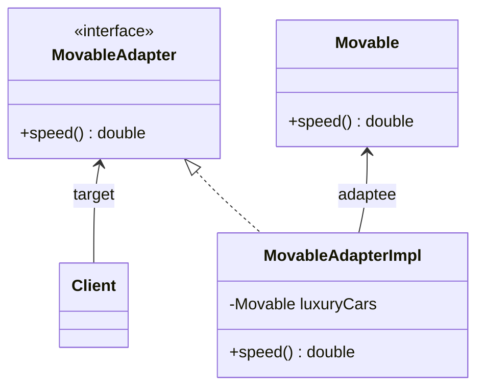

# Adapter Pattern

An adapter pattern acts as a connector between two incompatible interfaces that otherwise cannot be connected directly.

> convert an existing interface into another interface that the client expects

## Example
Scenario: there's an app that's developed in US which returns the top speed of luxury cars in MPH. Now we need to use the same app for our client in the UK that wants the same results but in KMPH.

To deal with this problem, we'll create an adapter which will convert the values and give us the desired results:


1. original interface _Movable_ -> returns the speed of some luxury car in MPH

```java
package com.hks.design.patterns.adapter;

public interface Movable {
    // returns speed in MPH
    public double getSpeed();
}

```

2. implementation of _Movable_ interface

```java
package com.hks.design.patterns.adapter;

public class BugattiVeyron implements Movable{
    @Override
    public double getSpeed() {
        return 368;
    }
}

```

3. An adapter interface _MovableAdapter_ that will be based on the same Movable class. It may be slightly modified to yield different results in different scenarios:

```java
package com.hks.design.patterns.adapter;

public interface MovableAdapter {
    // returns speed in KMPH
    public double getSpeed();
}

```

4. Implementation of _MovableAdapter_ interface - will consist of private method convertMPHtoKMPH() that will be used for conversion:

```java
package com.hks.design.patterns.adapter;

public class MovableAdapterImpl implements MovableAdapter{
    private Movable vehicle;

    // standard constructor
    public MovableAdapterImpl(Movable movable){
        this.vehicle = movable;
    }

    @Override
    public double getSpeed() {
        return convertMPHtoKMPH(vehicle.getSpeed());
    }

    public double convertMPHtoKMPH(double mph){
        return mph * 1.60934;
    }
}

```

5. Test

```java
package com.hks.design.patterns.adapter;

import org.junit.jupiter.api.Assertions;
import org.junit.jupiter.api.Test;

import static org.junit.jupiter.api.Assertions.*;

class MovableAdapterImplTest {

    @Test
    void getSpeed() {
        Movable bugatti = new BugattiVeyron();
        MovableAdapter bugattiAdapter = new MovableAdapterImpl(bugatti);
        Assertions.assertEquals(592.23712, bugattiAdapter.getSpeed());
        // assertEquals(float expected, float actual, float delta);
        Assertions.assertEquals(592.23712, bugattiAdapter.getSpeed(), .001);
        Assertions.assertEquals(592.2371, bugattiAdapter.getSpeed(), .001);
        //System.out.println(bugattiAdapter.getSpeed());
    }
}
```

## When to use Adapter Pattern
- When an outside component provides captivating functionality that we'd like to reuse, but it's incompatible with our current application. A suitable adapter can be developed to make them compatible with each other.
- When our application is not compatible with the interface that our client is expecting.
- When want to reuse legacy code in our application without making any modification in the original code.

<!-- https://www.baeldung.com/java-adapter-pattern -->
<!-- https://github.com/eugenp/tutorials/tree/master/patterns-modules/design-patterns-structural -->