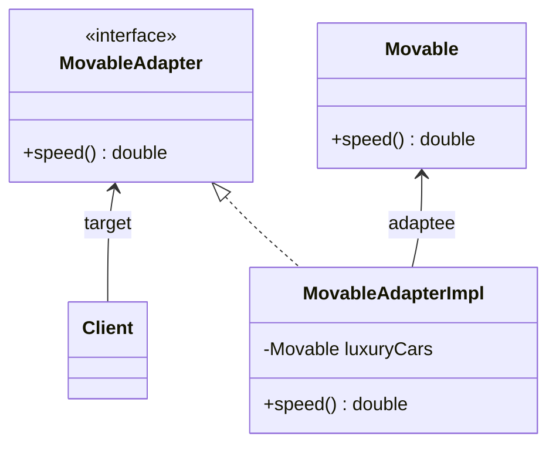

# Adapter Pattern

An adapter pattern acts as a connector between two incompatible interfaces that otherwise cannot be connected directly.

> convert an existing interface into another interface that the client expects

## Example

