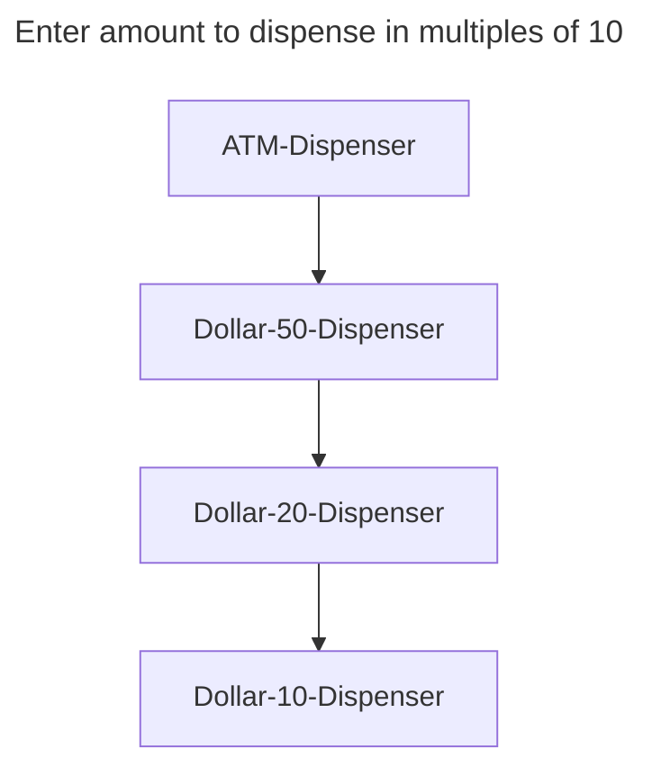
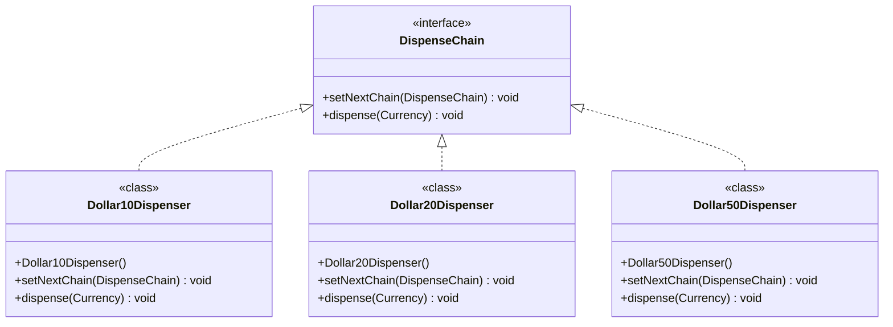

# Chain of Responsibility Design Pattern

__behavioral design pattern__

<!--
Chain of responsibility pattern is used to achieve loose coupling in software design where a request from client is passed to a chain of objects to process them. Then the object in the chain will decide themselves who will be processing the request and whether the request is required to be sent to the next object in the chain or not.
-->

- loose coupling in s/w design
- request is passed to chain of objects

__Example in JDK__

try with multiple catch ????

## Example

__ATM Dispense Machine__



### base class and interface

Currency.java - store the amount to dispense and used by the chain implementations.

```java
package com.hks.design.patterns.chainofresponsibility;

public class Currency {
    private int amount;
    public Currency(int amt){
        this.amount = amt;
    }

    public int getAmount() {
        return amount;
    }
}
```

base interface has
- method to define the next processor in the chain, and
- the method that'll process the request

```java
package com.hks.design.patterns.chainofresponsibility;

public interface DispenseChain {
    void setNextChain(DispenseChain nextChain);
    void dispense(Currency cur);
}
```

### chain implementations

```java
package com.hks.design.patterns.chainofresponsibility;

public class Dollar50Dispenser implements DispenseChain{
    private DispenseChain chain;
    @Override
    public void setNextChain(DispenseChain nextChain) {
        this.chain = nextChain;
    }

    @Override
    public void dispense(Currency cur) {
        if(cur.getAmount() >= 50){
            int num = cur.getAmount()/50;
            int remainder = cur.getAmount() % 50;
            System.out.println("dispensing " + num + "50$ notes.");
            if(remainder != 0) this.chain.dispense(new Currency(remainder));
        }else{
            this.chain.dispense(cur);
        }
    }
}
```

```java
package com.hks.design.patterns.chainofresponsibility;

public class Dollar20Dispenser implements DispenseChain{
    private DispenseChain chain;
    @Override
    public void setNextChain(DispenseChain nextChain) {
        this.chain = nextChain;
    }

    @Override
    public void dispense(Currency cur) {
        if(cur.getAmount() >= 20){
            int num = cur.getAmount()/20;
            int remainder = cur.getAmount() % 20;
            System.out.println("dispensing "+num+"20$ notes");
            if(remainder != 0) this.chain.dispense(new Currency(remainder));
        }else{
            this.chain.dispense(cur);
        }
    }
}
```

```java
package com.hks.design.patterns.chainofresponsibility;

public class Dollar10Dispenser implements DispenseChain{
    private DispenseChain chain;

    @Override
    public void setNextChain(DispenseChain nextChain) {
        this.chain = nextChain;
    }

    @Override
    public void dispense(Currency cur) {
        if(cur.getAmount() >= 10){
            int num = cur.getAmount()/10;
            int remainder = cur.getAmount() % 10;
            System.out.println("dispensing "+num+" 10$ notes");
            if(remainder != 0) this.chain.dispense(new Currency(remainder));
        }else{
            this.chain.dispense(cur);
        }
    }
}
```

### Creating the chain

```java
package com.hks.design.patterns.chainofresponsibility;

import java.util.Scanner;

public class ATMDispenseChain {

    private DispenseChain c1;

    public ATMDispenseChain(){
        // initialize the chain
        this.c1 = new Dollar50Dispenser();
        DispenseChain c2 = new Dollar20Dispenser();
        DispenseChain c3 = new Dollar10Dispenser();

        // set the chain of responsibility
        c1.setNextChain(c2);
        c2.setNextChain(c3);
    }

    public static void main(String[] args) {
        ATMDispenseChain atmDispenser = new ATMDispenseChain();
        while (true){
            int amount = 0;
            System.out.println("Enter amount to dispense");
            Scanner input = new Scanner(System.in);
            amount = input.nextInt();
            if(amount % 10 != 0){
                System.out.println("Amount should be in multiple of 10s");
                return;
            }
            // process the request
            atmDispenser.c1.dispense(new Currency(amount));
        }
    }
}
```

### class diagram



### important points

- client will send the request to the first object in the chain
- Each object in the chain will have it’s own implementation to process the request, either full or partial or to send it to the next object in the chain.
- Every object in the chain should have reference to the next object in chain to forward the request to, its achieved by java composition.
- Creating the chain carefully is very important otherwise there might be a case that the request will never be forwarded to a particular processor or there are no objects in the chain who are able to handle the request. In my implementation, I have added the check for the user entered amount to make sure it gets processed fully by all the processors but we might not check it and throw exception if the request reaches the last object and there are no further objects in the chain to forward the request to. This is a design decision.
- Chain of Responsibility design pattern is good to achieve lose coupling but it comes with the trade-off of having a lot of implementation classes and maintenance problems if most of the code is common in all the implementations.

### Examples in JDK

- java.util.logging.Logger#log()
- javax.servlet.Filter#doFilter()

<!--
https://www.digitalocean.com/community/tutorials/composition-in-java-example
-->