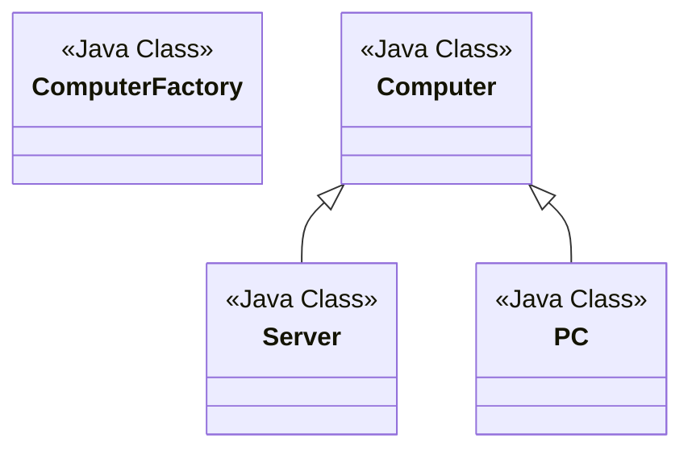

# Factory <!-- aka Factory Method Design Pattern -->
<!-- Creational pattern -->
Given a superclass with multiple sub-classes and based on input, we need to return one of the sub-class.
<!-- https://www.digitalocean.com/community/tutorials/factory-design-pattern-in-java -->
<!-- https://github.com/WebJournal/journaldev/tree/master/java-design-patterns/Factory-Design-Pattern -->
This pattern takes out the responsibility of the instantiation of a class from the client to the client program to the factory class.
## Factory Desing Pattern Super Class
Super class in factory design pattern can be 
- an interface
- an abstract class, ot
- a java class

</br>We'll take an abstract class as super class for following demo

```java
package com.patterns.abstractfactory;

public abstract class Computer {
    public abstract String getRAM();
    public abstract String getHDD();
    public abstract String getCPU();

    @Override
    public String toString() {
        return "RAM: " +this.getRAM()+
                " HDD: " + this.getHDD()+
                " CPU: " + this.getCPU();
    }
}
```

## Factory Design Pattern Sub Classes

```java
package com.patterns.factory;

public class PC extends Computer{
    private String ram;
    private String hdd;
    private String cpu;

    public PC(String ram, String hdd, String cpu){
        this.ram = ram;
        this.hdd = hdd;
        this.cpu = cpu;
    }

    @Override
    public String getRAM() {
        return this.ram;
    }

    @Override
    public String getHDD() {
        return this.hdd;
    }

    @Override
    public String getCPU() {
        return this.cpu;
    }
}

```

```java
package com.patterns.factory;

public class Server extends Computer{
    private String ram;
    public String hdd;
    private String cpu;

    public Server(String ram, String hdd, String cpu){
        this.ram = ram;
        this.hdd = hdd;
        this.cpu = cpu;
    }

    @Override
    public String getRAM() {
        return this.ram;
    }

    @Override
    public String getHDD() {
        return this.hdd;
    }

    @Override
    public String getCPU() {
        return this.cpu;
    }
}

```

## Factory Class

```java
package com.patterns.factory;

public class ComputerFactory {
    public static Computer getComputer(String type, String ram, String hdd, String cpu){
        if("PC".equalsIgnoreCase(type)){
            return new PC(ram, hdd, cpu);
        } else if ("Server".equalsIgnoreCase(type)) {
            return new Server(ram, hdd, cpu)
        }
        return null;
    }
}

```
1. We can keep Factory class Singleton or we can keep the method that returns the subclass as static.
2. getComputer is the factory method.




  
```java
package com.patterns.factory;

public class TestFactory {
    public static void main(String[] args) {
        Computer pc = ComputerFactory.getComputer("pc", "2 GB", "500 GB", "2.4 GHz");
        Computer server = ComputerFactory.getComputer("server", "16 GB", "1 TB", "2.9 GHz");
        System.out.println("Factory PC config: " + pc);
        System.out.println("Factory server config: " + server);
    }
}

```

## Advantages
1. Provides approach to code for interface rather than implementation.
2. Removes the instantiation of actual implementation classes from client code. Makes code more rubust, less coupled and easy to extend.    
3. Provides abstraction between implementation and client classes through inheritance.

## Examples in JDK
1. java.util.Calendar, ResourceBundle and NumberFormat getInstance() method uses Factory Pattern.
2. valueOf() method in wrapper classes like Boolean, Integer, etc.


