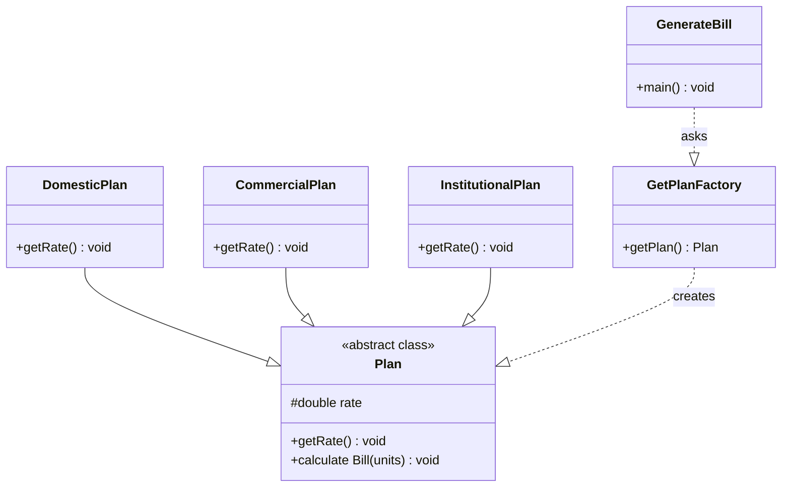

# Factory Method <!-- aka Virtual Constructor -->
aka __Virtual Constructor__
<!-- https://www.javatpoint.com/factory-method-design-pattern -->
Define an interface or abstract class for creating an object but let the subclasses decide which class to instantiate. In other words, subclasses  are responsible to create the instance of the class.

## Advantages
1. Allows the subclasses to choose the type of objects to create.
2. Promotes __loose-coupling__ by eliminating the need to bind application-specific classes into the code. -> code interacts solely with the resultant interface or abstract class, so it'll work with any classes that implement the interface or that extends the abstract class.

## Usage
1. When a class doesn't know what sub-classes will be required to create.
2. When a class wants that it's subclasses specify the objects to be created.
3. When the parent classes choose the creation of objects to its subclasses.

## UML for Factory Method Pattern
1. Plan - abstract class, and concrete classes that extends the Plan abstract class
2. A factory class, GetPlanFactory
3. GenerateBill class will use GetPlanFactory to get a Plan object. It'll pass information (planType - DOMESTICPLAN / COMMERCIALPLAN / INSTITUTIONALPLAN) to GetPlanFactory to get the type of object it needs.



## Calculate Electricity Bill : Example of Factory Method

Step 1: Create a Plan abstract class.

```java
package com.hks.design.patterns.factorymethod;

public abstract class Plan {
    protected double rate;
    abstract void getRate();

    public void calculateRate(int units){
        System.out.println("rate is : " + units * rate);
    }
}

```

Step 2: Create the concrete classes that extends Plan abstract class.

```java
package com.hks.design.patterns.factorymethod;

public class DomesticPlan extends Plan{

    @Override
    void getRate() {
        rate = 3.50;
    }
}

```

```java
package com.hks.design.patterns.factorymethod;

public class CommercialPlan extends Plan{
    @Override
    void getRate() {
        rate = 7.50;
    }
}

```

```java
package com.hks.design.patterns.factorymethod;

public class InstitutionalPlan extends Plan{
    @Override
    void getRate() {
        rate = 5.50;
    }
}

```

Step 3: Create a GetPlanFactory to generate object of concrete classes based on given information

```java
package com.hks.design.patterns.factorymethod;

public class GetPlanFactory {

    public Plan getPlan(String planType){
        if (planType == null){
            return null;
        }
        if (planType.equalsIgnoreCase("DOMESTICPLAN")){
            return new DomesticPlan();
        }
        if (planType.equalsIgnoreCase("COMMERCIALPLAN")){
            return new CommercialPlan();
        }
        if (planType.equalsIgnoreCase("INSTITUTIONALPLAN")){
            return new InstitutionalPlan();
        }
        return null;
    }
}

```

Step 4: Generate bill by using the GetPlanFactory to get the object of concrete classes by passing an information such as type of plan DOMESTICPLAN or COMMERCIALPLAN or INSTITUTIONALPLAN.

```java
package com.hks.design.patterns.factorymethod;

import java.io.BufferedReader;
import java.io.IOException;
import java.io.InputStreamReader;

public class GenerateBill {
    public static void main(String[] args) throws IOException {
        GetPlanFactory planFactory = new GetPlanFactory();

        System.out.println("Enter the name of the plan for which the bill will be generated.");
        BufferedReader br = new BufferedReader(new InputStreamReader(System.in));

        String planName = br.readLine();
        System.out.println("Enter the number of units for which bill will be calculated.");
        int units = Integer.parseInt(br.readLine());

        Plan p = planFactory.getPlan(planName);
        // call getRate() method and calculateBill() method of DomesticPlan.

        System.out.println("Bill amount for " + planName + " of " + units + " units is: ");
        p.getRate();
        p.calculateRate(units);

    }
}

```