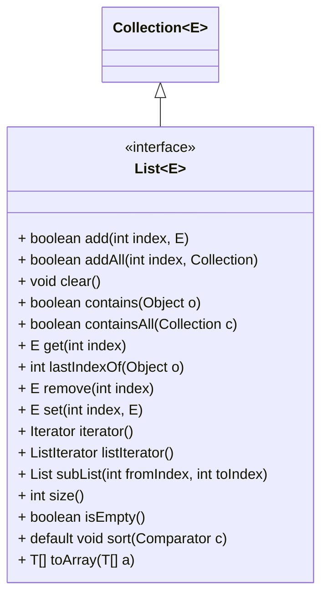
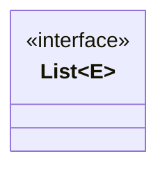

//list




**Methods inherited from interface java.util.Collection** </br>
parallelStream, removeIf, stream

**Methods inherited from interface java.lang.Iterable** </br>
forEach

**Adding elements of the sub types of the declared types:**
```java
List<Number> numbers = new ArrayList<>();
numbers.add(new Integer(123));
numbers.add(new Float(3.1415));
numbers.add(new Double(299.988));
numbers.add(new Long(67000));

System.out.println(numbers);  // [123, 3.1415, 299.988, 67000]
List<Integer> integers = Arrays.asList(1,2,3,4,5);
numbers.addAll(1,integers);
System.out.println(numbers); // [123, 1, 2, 3, 4, 5, 3.1415, 299.988, 67000]
```

> int indexOf(Object o)

> int lastIndexOf(Object 0)

Note that all elements in the list must implement the Comparableinterface, 
so if you define your own type, 
make sure it implements that interface and its compareTo() method.

```java
static <T extends Comparable<? super T>>
void	sort(List<T> list)

static <T> void	sort(List<T> list, Comparator<? super T> c)

// e.g.,
listStrings.sort(null); // sort by natural ordering of the elements

Collections.sort(integers, Comparator.reverseOrder());

Collections.copyLst(src, dest)

```

Collections.shuffle();
Collections.reverse();

Collections.subList(fromIndex, toIndex) // fromIndex(inclusive), toIdex(exclusinve)


The `Arrays.asList(T… a)` method converts an array of type T to a list of type T. Here’s an example:

List<String> listNames = Arrays.asList("John", "Peter", "Tom", "Mary", "David", "Sam");
List<Integer> listNumbers = Arrays.asList(1, 3, 5, 7, 9, 2, 4, 6, 8);
System.out.println(listNames);
System.out.println(listNumbers);


And the Listinterface provides the `toArray()` method that returns an array of Objects containing all of the elements in the list in proper sequence (from first to last element). Here’s an example:

List<String> listWords = new ArrayList<String>();
// add elements to the list
Object[] arrayWords = listWords.toArray();

And the `toArray(T[] a)` method returns an array of type T, for example:

String[] words = listWords.toArray(new String[0]);
Integer[] numbers = listNumbers.toArray(new Integer[0]);

**Note** that the returned array contains copies of elements in the list, 
which that means we can safely modify the array without affecting the list.

**List to Stream**

List.stream(): returns a sequential stream.
List.parallelStream(): returns a possibly parallel stream.

e.g., int sum = numbers.stream().reduce(0, (x, y) -> x + y);

**Concurrent lists**

By default, ArrayList and LinkedList are not thread-safe, 
so if you want to use them in concurrent context, 
you have to synchronize them externally using the `Collections.synchronizedList()` static method which returns a synchronized list that wraps the specified list. 
For example:

```java
List<Object> unsafeList = new ArrayList<Object>();
List<Object> safeList = Collections.synchronizedList(unsafeList);
```

**Note** that you must manually synchronize the returned list when iterating over it, 
for example:
```java
synchronized (safeList) {
Iterator<Object> it = safeList.iterator();
while (it.hasNext()) {
System.out.println(it.next());
}
}
```

#


<!-- https://www.codejava.net/java-core/collections/java-list-collection-tutorial-and-examples -->
<!-- https://mermaid.js.org/syntax/classDiagram.html -->
