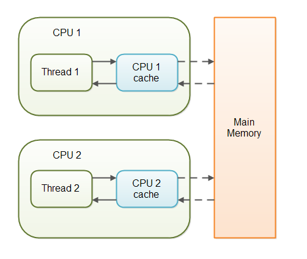
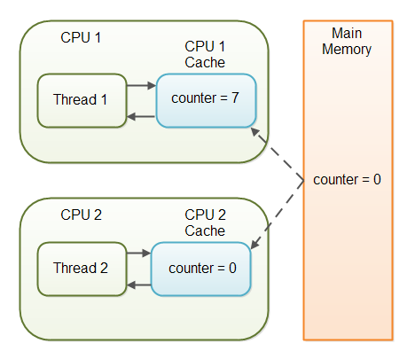
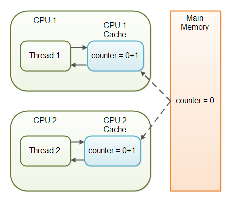

`volatile` keyword

- used to mark a Java variable as "being stored in main memory".

every read of a volatile variable will be read from the computer's main memory, 
and not from the CPU cache, 
and that every write to a volatile variable will be written to main memory, 
and not just the the CPU cache.

# Variable visibility problems




```java
public class SharedObject {

    public int counter = 0;

}
```



# The Java Volatile Visibility Guarantee

```java
public class SharedObject {

    public volatile int counter = 0;

}
```
- Declaring a variable volatile thus guarantees the visibility for other threads of writes to that variable.

## Full Volatile Visibility Guarantee
The visibility guarantee is as follows:

- If Thread A writes to a volatile variable and Thread B subsequently reads the same volatile variable, then all variables visible to Thread A before writing the volatile variable, will also be visible to Thread B after it has read the volatile variable.
- If Thread A reads a volatile variable, then all all variables visible to Thread A when reading the volatile variable will also be re-read from main memory.

# Instruction Reordering Challenges
The Java VM and the CPU are allowed to reorder instructions in the program for performance reasons, 
as long as the semantic meaning of the instructions remain the same.

Example:
```java
int a = 1;
int b = 2;

a++;
b++;
```
to
```java
int a = 1;
a++;

int b = 2;
b++;
```
However, instruction reordering present a challenge when one of the variables is a volatile variable.

Example:
```java
public class MyClass {
    private int years;
    private int months
    private volatile int days;


    public void update(int years, int months, int days){
        this.years  = years;
        this.months = months;
        this.days   = days;
    }
}
```
change method to
```java
public void update(int years, int months, int days){
    this.days   = days;
    this.months = months;
    this.years  = years;
}
```
The values of months and years are still written to main memory when the days variable is modified, 
but this time it happens before the new values have been written to months and years. 
The new values are thus not properly made visible to other threads. 
The semantic meaning of the reordered instructions has changed.

# The Java volatile Happens-Before Guarantee
To address the instruction reordering challenge, 
the Java `volatile` keyword gives a "happens-before" guarantee, 
in addition to the visibility guarantee. 
The happens-before guarantee guarantees that:

- Reads from and writes to other variables cannot be reordered to occur after a write to a `volatile` variable, if the reads / writes originally occurred before the write to the volatile variable.
The reads / writes before a write to a volatile variable are guaranteed to "happen before" the write to the volatile variable. Notice that it is still possible for e.g. reads / writes of other variables located after a write to a volatile to be reordered to occur before that write to the volatile. Just not the other way around. From after to before is allowed, but from before to after is not allowed.
- Reads from and writes to other variables cannot be reordered to occur before a read of a volatile variable, if the reads / writes originally occurred after the read of the volatile variable. Notice that it is possible for reads of other variables that occur before the read of a volatile variable can be reordered to occur after the read of the volatile. Just not the other way around. From before to after is allowed, but from after to before is not allowed.

The above happens-before guarantee assures that the visibility guarantee of the volatile keyword are being enforced.

# volatile is not always enough
> Example: [com.tutorial.concurrency.SynchronisedExample1](https://github.com/hks1/java-tutorial/blob/main/src/main/java/com/tutorial/concurrency/SynchronisedExample1.java)

[race condition](https://jenkov.com/tutorials/java-concurrency/race-conditions-and-critical-sections.html) where multiple threads might read the same value of the volatile variable, generate a new value for the variable, and when writing the value back to main memory - overwrite each other's values.

The situation where multiple threads are incrementing the same counter is exactly such a situation where a volatile variable is not enough.

Example:



## When is volatile Enough?
if two threads are both reading and writing to a shared variable, 
then using the volatile keyword for that is not enough. 
You need to use a [synchronized](https://jenkov.com/tutorials/java-concurrency/synchronized.html) in that case to guarantee that the reading and writing of the variable is atomic.
Reading or writing a volatile variable does not block threads reading or writing. 
For this to happen you must use the `synchronized` keyword around critical sections.

As an alternative to a synchronized block you could also use one of the many atomic data types found in the **java.util.concurrent package**. For instance, the `AtomicLong` or `AtomicReference` or one of the others.

In case only one thread reads and writes the value of a volatile variable and other threads only read the variable, then the reading threads are guaranteed to see the latest value written to the volatile variable. Without making the variable volatile, this would not be guaranteed.

The `volatile` keyword is guaranteed to work on 32 bit and 64 variables.

# Performance considerations of volatile
Reading and writing of volatile variables causes the variable to be read or written to main memory. 
Reading from and writing to main memory is more expensive than accessing the CPU cache. 
Accessing volatile variables also prevent instruction reordering which is a normal performance enhancement technique. 
Thus, you should only use volatile variables when you really need to enforce visibility of variables.

<!-- https://jenkov.com/tutorials/java-concurrency/volatile.html -->
