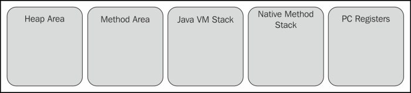
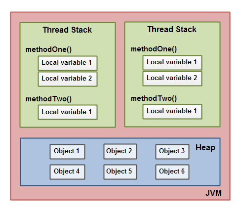
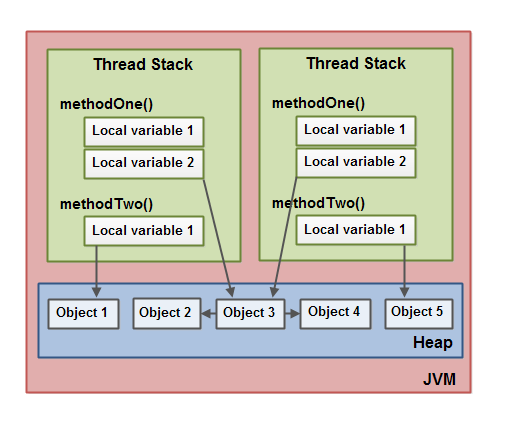
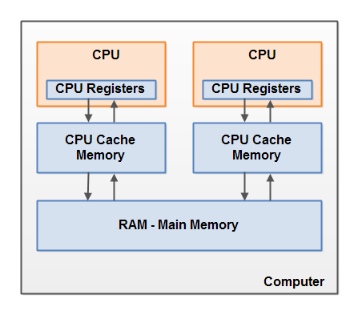
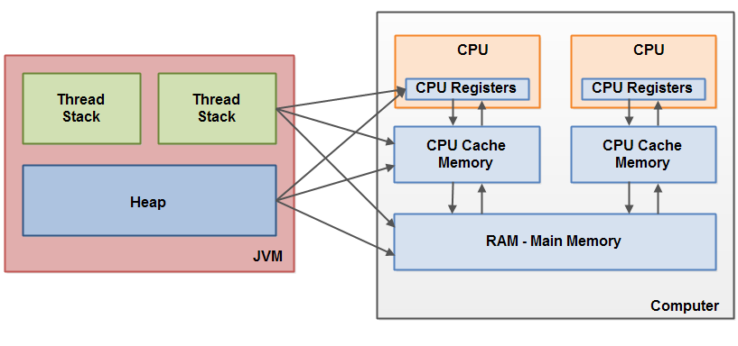
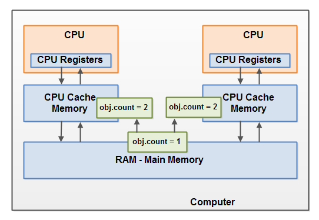

# Java Memory Model
## The Internal Java Memory Model

- Each thread running in the Java virtual machine has its own thread stack.
- The thread stack contains information about what methods the thread has called to reach the current point of execution. - `call stack`
- As the thread executes its code, the call stack changes.

- All local variables of primitive types ( boolean, byte, short, char, int, long, float, double) are fully stored on the thread stack and are thus not visible to other threads.
- One thread may pass a copy of a primitive variable to another thread, but it cannot share the primitive local variable itself.

- The heap contains all objects created in the Java application, regardless of what thread created the object.
- This includes the object versions of the primitive types (e.g. Byte, Integer, Long etc.).
-  It does not matter if an object was created and assigned to a local variable, or created as a member variable of another object, the object is still stored on the heap.

- A local variable may be of a primitive type, in which case it is totally kept on the thread stack.
- A local variable may also be a reference to an object. In that case the reference (the local variable) is stored on the thread stack, but the object itself if stored on the heap.
- An object may contain methods and these methods may contain local variables. These local variables are also stored on the thread stack, even if the object the method belongs to is stored on the heap.
- An object's member variables are stored on the heap along with the object itself. That is true both when the member variable is of a primitive type, and if it is a reference to an object.
- Static class variables are also stored on the heap along with the class definition.

> Objects on the heap can be accessed by all threads that have a reference to the object. When a thread has access to an object, it can also get access to that object's member variables. If two threads call a method on the same object at the same time, they will both have access to the object's member variables, but each thread will have its own copy of the local variables.

# Hardware Memory Architecture

--
Typically, when a CPU needs to access main memory it will read part of main memory into its CPU cache. It may even read part of the cache into its internal registers and then perform operations on it. When the CPU needs to write the result back to main memory it will flush the value from its internal register to the cache memory, and at some point flush the value back to main memory.

The values stored in the cache memory is typically flushed back to main memory when the CPU needs to store something else in the cache memory. The CPU cache can have data written to part of its memory at a time, and flush part of its memory at a time. It does not have to read / write the full cache each time it is updated. Typically the cache is updated in smaller memory blocks called "cache lines". One or more cache lines may be read into the cache memory, and one or mor cache lines may be flushed back to main memory again.

On the hardware, both the thread stack and the heap are located in main memory. Parts of the thread stacks and heap may sometimes be present in CPU caches and in internal CPU registers. This is illustrated in this diagram:

When objects and variables can be stored in various different memory areas in the computer, certain problems may occur. The two main problems are:

- Visibility of thread updates (writes) to shared variables.
- Race conditions when reading, checking and writing shared variables.

## Visibility of Shared Objects
If two or more threads are sharing an object, without the proper use of either `volatile` declarations or synchronization, updates to the shared object made by one thread may not be visible to other threads.

Imagine that the shared object is initially stored in main memory. A thread running on CPU one then reads the shared object into its CPU cache. There it makes a change to the shared object. As long as the CPU cache has not been flushed back to main memory, the changed version of the shared object is not visible to threads running on other CPUs. This way each thread may end up with its own copy of the shared object, each copy sitting in a different CPU cache.

> `volatile` keyword can be used to solve this problem. The `volatile` keyword can make sure that a given variable is read directly from main memory, and always written back to main memory when updated.

[Java's volatile keyword](https://jenkov.com/tutorials/java-concurrency/volatile.html)

## Race Condition
If two or more threads share an object, and more than one thread updates variables in that shared object, **race conditions** may occur.

Imagine if thread A reads the variable count of a shared object into its CPU cache. Imagine too, that thread B does the same, but into a different CPU cache. Now thread A adds one to count, and thread B does the same. Now var1 has been incremented two times, once in each CPU cache.

If these increments had been carried out sequentially, the variable count would be been incremented twice and had the original value + 2 written back to main memory.

However, the two increments have been carried out concurrently without proper synchronization. Regardless of which of thread A and B that writes its updated version of count back to main memory, the updated value will only be 1 higher than the original value, despite the two increments.

To solve this problem you can use a [Java synchronized block](https://jenkov.com/tutorials/java-concurrency/synchronized.html). A synchronized block guarantees that only one thread can enter a given critical section of the code at any given time. Synchronized blocks also guarantee that all variables accessed inside the synchronized block will be read in from main memory, and when the thread exits the synchronized block, all updated variables will be flushed back to main memory again, regardless of whether the variable is declared volatile or not.

<!-- https://jenkov.com/tutorials/java-concurrency/java-memory-model.html -->
<!-- https://howtodoinjava.com/java/garbage-collection/java-memory-model/ -->