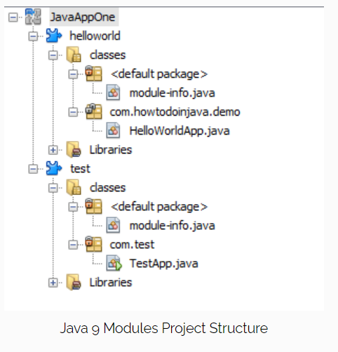
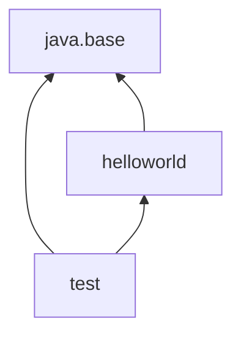

# JPMS [Java Platform Module System aka Project Jigsaw, "Modules" for short]

- group of closely related packages and resources along with a new module descriptor file (metadata).
- Each module is responsible for its resources, like media or configuration files.

In terms of application architecture, a module shall represent a specific business capability. It should be self-sufficient for that capability and should expose only interfaces to use the module functionality. To complete its tasks, it may be dependent on other modules, which it should declare explicitly.

a module should adhere to __three core principles__ - 
- Strong Encapsulation
- Stable Abstraction
- Explicit Dependencies

## Introduction to JPMS
### The Problem
Before Java 9, there were packages to group related classes as per business capabilities and https://howtodoinjava.com/java/oops/java-access-modifiers/ to control the visibility.

explicit dependencies

In Java, dependencies are declared with ‘import‘ statements; but they are strictly ‘compile time’ constructs.

Once code is compiled, there is no mechanism to state its runtime dependencies clearly. In fact, Java runtime dependency resolution is such a problematic area that special tools have been created to fight this problem e.g., https://howtodoinjava.com/gradle/gradle-tutorial-installation-and-hello-world-example/ or https://howtodoinjava.com/maven/.

Also, a few frameworks started bundling their complete runtime dependencies as well e.g., https://howtodoinjava.com/spring-boot/spring-boot-tutorial-with-hello-world-example/ projects.

### How does JPMS solve the problem?

**java 9 modules** - better capability to write well-structured applications. This enhancement is divided into two areas:
1. Modularize the JDK itself.
2. Offer a module system for other applications to use.

#### Java Base Module
**java.base**

- a class is a container of fields and methods
- a package is a container of classes and interfaces
- a module is a container of packages
#### Modular vs non-modular code
| |                                                                            |
|---|----------------------------------------------------------------------------|
| A module | is typically just a jar file that has a module-info.class file at the root |
| To use a module, | include the jar file into `modulepath` instead of the `classpath`.         |

>>> A modular jar file added to the classpath is normal jar file and module-info.class file will be ignored.


## Module Descriptor
- Name
- Dependencies
- Public Packages – a list of all packages we want accessible from outside the module
- Services Offered – we can provide service implementations that can be consumed by other modules
- Services Consumed – allows the current module to be a consumer of a service
- Reflection Permissions – explicitly allows other classes to use reflection to access the private members of a package

The module naming rules are similar to how we name packages (dots are allowed, dashes are not). It's very common to do either project-style (my.module) or Reverse-DNS (com.example.mymodule) style names. 

We need to list all packages we want to be public because by default all packages are module private.

The same is true for reflection. By default, we cannot use reflection on classes we import from another module.

In Java 9, modules help us in encapsulating packages and managing dependencies. So typically,

- a class is a container of fields and methods
- a package is a container of classes and interfaces
- a module is a container of packages

## Module Types

### System Modules
- `list-modules`
- Java SE and JDK modules
### Application Modules
named and defined in the compiled __module-info.class__ file included in the assembled jar.
### Automatic Modules
We can include unofficial modules by adding existing JAR files to the module path. The name of the module will be derived from the name of the JAR. Automatic modules will have full read access to every other module loaded by the path.
### Unnamed Module
When a class or JAR is loaded onto the classpath, but not the module path, it's automatically added to the unnamed module. It's a catch-all module to maintain backward compatibility with previously-written Java code.

## Distribution
Modules can be distributed one of two ways: as a JAR file or as an “exploded” compiled project. This, of course, is the same as any other Java project so it should come as no surprise.

We can create multi-module projects comprised of a “main application” and several library modules.

- one module per JAR file

When we set up our build file, we need to make sure to bundle each module in our project as a separate jar.

## Default Modules

`java --list-modules`

## Example

### Create java modules



```java
/*
        /helloworld/module-info.java
 */
module helloworld{}
```

```java
/*
        HelloWorldApp.java
 */
package com.mod.demo;

public class HelloWorldApp{
    public static void sayHello(){
        System.out.println("Hello from HelloWorldApp");
    }
}
```

```java
/*
        /test/module-info.java
 */
module test{
    
}
```

```java
/*
        TestApp.java
 */
package com.test;

public class TestApp{
    public static void main(String[] args) {
        // some code
    }
}
```
so far, modules are independent.

if we use HelloWorldApp.sayHello() method in TestApp class without importing the module, we'll get compile-time error "package is not visible".

### Export packages and import module

to be able to import HelloWorldApp, first we need to export 'com.mod.demo' package from helloworld module and then include helloworld module in test module.

```java
module helloworld{
    exports com.mod.demo;
}
```
```java
module test{
    requires helloworld; //dependency
        }

```

```java
package com.test;

import com.mod.demo.HelloWorldApp;

public class TestApp{
    public static void main(String[] args) {
        HelloWorldApp.sayHello();
    }
}
```



>>> `Modularity` is an architectural principle that can prevent "spaghetti architecture" and "messy monolith" problems to a high degree.

<!-- https://howtodoinjava.com/java9/java-9-modules-tutorial/ -->