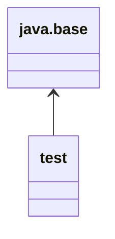

# JPMS [Java Platform Module System, "Modules" for short]
- Project Jigsaw

- (package-like) artifacts containing code, with metadata describing the module and its relation to other modules. 

- group of closely related packages and resources along with a new module descriptor file (metadata).
  
- Each module is responsible for its resources, like media or configuration files.
- JPMS allows the user to create their modules to develop their applications.

-> jlink: The Java Linker, allows the user to create executable.

In terms of application architecture, a module shall represent a specific business capability. It should be self-sufficient for that capability and should expose only interfaces to use the module functionality. To complete its tasks, it may be dependent on other modules, which it should declare explicitly.

a module should adhere to __three core principles__ - 
- Strong Encapsulation
- Stable Abstraction - helps to expose module functionality using interfaces, i.e., public APIs.
- Explicit Dependencies

__Need of JPMS__  
- JDK is too big (before JPMS was introduced in Java SE 9), results in big JRE size, affects performance.
- JAR files like rt.jar etc are too big to use in small devices and applications.
- no encapsulation
- security issues because of "public" access modifier being too open and no restriction on internal APIs.
- no loose coupling

__Advantages__ [JPMS]  
- Modularize the JDK itself.
- Offer a module system for other applications to use.

## Module Descriptor
- Name
- Dependencies
- Public Packages – a list of all packages we want accessible from outside the module
- Services Offered – we can provide service implementations that can be consumed by other modules
- Services Consumed – allows the current module to be a consumer of a service
- Reflection Permissions – explicitly allows other classes to use reflection to access the private members of a package

The module naming rules are similar to how we name packages (dots are allowed, dashes are not). It's very common to do either project-style (my.module) or Reverse-DNS (com.example.mymodule) style names. 

We need to list all packages we want to be public because by default all packages are module private.

The same is true for reflection. By default, we cannot use reflection on classes we import from another module.

In Java 9, modules help us in encapsulating packages and managing dependencies. So typically,

- a class is a container of fields and methods
- a package is a container of classes and interfaces
- a module is a container of packages

## Module Types

### System Modules
- `list-modules`
- Java SE and JDK modules
### Application Modules
named and defined in the compiled __module-info.class__ file included in the assembled jar.
### Automatic Modules
We can include unofficial modules by adding existing JAR files to the module path. The name of the module will be derived from the name of the JAR. Automatic modules will have full read access to every other module loaded by the path.
### Unnamed Module
When a class or JAR is loaded onto the classpath, but not the module path, it's automatically added to the unnamed module. It's a catch-all module to maintain backward compatibility with previously-written Java code.

## Distribution
Modules can be distributed one of two ways: as a JAR file or as an “exploded” compiled project. This, of course, is the same as any other Java project so it should come as no surprise.

We can create multi-module projects comprised of a “main application” and several library modules.

- one module per JAR file

When we set up our build file, we need to make sure to bundle each module in our project as a separate jar.

## Default Modules

`java --list-modules`

- All JDK Modules starts with “jdk.*”
- All Java SE Specifications Modules starts with “java.*”

### Java Base Module
Java 9 Module System has a `java.base` module. It’s known as __Base Module__. It’s an Independent module and does NOT dependent on any other modules. By default, all other modules are dependent on “java.base“.

In Java 9, modules help us in encapsulating packages and managing dependencies. So typically,

- a class is a container of fields and methods
- a package is a container of classes and interfaces
- a module is a container of packages

### Difference between modular and non-modular code
You will not feel any significant difference between regular code and modular code if you don’t know the specific things to look for. e.g.

A module is typically just a jar file that has a __module-info.class__ file at the root.
To use a module, include the jar file into __modulepath__ instead of the __classpath__. A modular jar file added to classpath is normal jar file and __module-info.class__ file will be ignored.

## Example

module: helloworld, method sayHello()
module: testmodule

<!--
https://howtodoinjava.com/java9/java-9-modules-tutorial/ 
-->